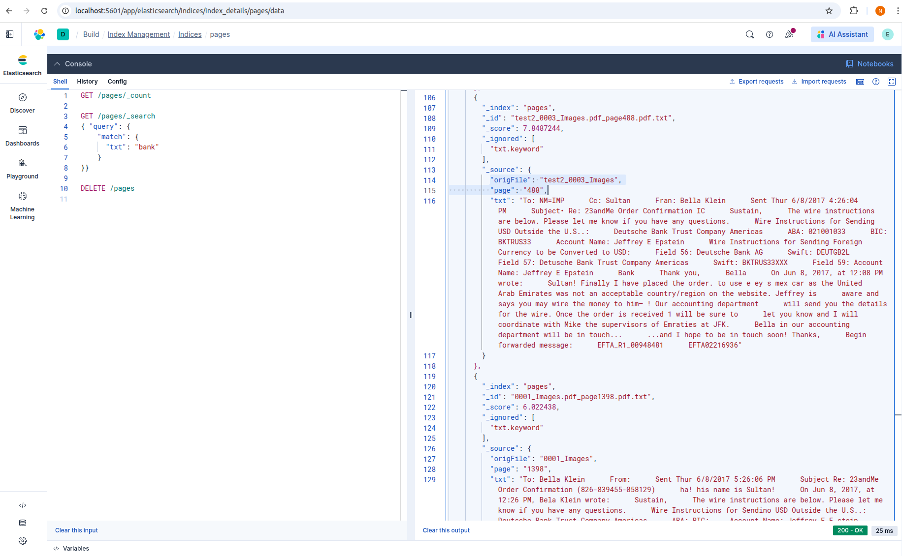

# PDF to Searchable Text

This repository contains code for processing PDF files and making the text searchable.

## Work In Progress
Currently, you can split a PDF file into individual pages and extract the text from these pages. 
You can also upload the text-pages to a local ElasticSearch instance and search the text.
A [test class](src/test/java/org/informiz/pdf/txt/PdfDocumentServiceTest.java) is available for running it locally.
The resulting files are written to the default "tmp" directory of your system (e.g., /tmp in linux).

## The Epstein text
As an example, you can find the text extracted from the first release of the Epstein files in the 
[test/resources/converted](src/test/resources/converted) folder. 
Note that only one of the original PDF files are available in this repository, since they are quite big and are 
available elsewhere online.

## Local setup instructions
Not a software developer? Not a problem! 
All you need is:
* The Java Development Kit - one-time [installation](https://formulae.brew.sh/formula/openjdk@21)
* Docker - [same](https://docs.docker.com/compose/install/), for running ElasticSearch inside a mini-virtual-machine on your laptop
* ElasticSearch - [same](https://www.elastic.co/docs/deploy-manage/deploy/self-managed/local-development-installation-quickstart), for searching
You can use the pre-compiled [app.jar](app.jar) to run the code locally.

### Want just the text?
You can use the following command if all you want is the text, without using ElasticSearch:
`java -cp path/to/app.jar org.informiz.pdf.txt.PdfDocumentService /full/path/to/pdf/folder/`


### Want to search?
You will see that the ElasticSearch installation has created a folder called `elastic-start-local` in your file system.  
Inside the folder there's a `.env` file, and inside it you'll find your local password and API key. 
For example: 
```properties
START_LOCAL_VERSION=0.13.0
ES_LOCAL_VERSION=9.2.4
...
ES_LOCAL_PASSWORD=P@#$IT@GJB
...
ES_LOCAL_API_KEY=je0i4rfvnho....ero8p9vk4jw==
```
After the initial installation you can always start up ElasticSearch by executing the `elastic-start-local/start.sh` 
script, and similarly shut it down by executing the `elastic-start-local/stop.sh` script, as described in their 
[documentation](https://github.com/elastic/start-local).

Once your ElasticSearch instance is running, place all your PDF documents in a folder (and possibly sub-folders), and 
pass the full path to the Java code that extracts the text and uploads it to ElasticSearch. You will also need to 
provide the aforementioned ES_LOCAL_API_KEY to the application. E.g., from the command-line:
`ES_LOCAL_API_KEY=je0i4rfvnho....ero8p9vk4jw== java -cp path/to/app.jar org.informiz.pdf.txt.ElasticSearchService /full/path/to/pdf/folder/"`



Note that the original file-name (including sub-directories relative to the provided folder), as well as the 
page-number, are available in the records returned by ElasticSearch.

### Named Entities Recognition
There is additional processing that you can run on the text-pages in order to extract named-entities (such as people and 
places, but also dates). You can then upload these records to ElasticSearch and search by e.g., a date-range.

x

It requires also installing Python, instructions are available in the [nlp folder](/nlp/README.md)
